<div align="center">
  
</div>

### `$ whoami`

Software Engineer at **Samsung Electronics (Visual Display Division)** and Computer Engineering student — building automation solutions, AI-powered applications and data-driven systems that support manufacturing and business operations.

Also co-founder of **Kacto Services**, an AI startup focused on intelligent customer service automation.

```text
$ cat expertise.txt
[x] software engineering          [x] machine learning
[x] ai & intelligent agents       [x] process automation (rpa)
[x] data engineering & analytics  [x] full stack development
[x] manufacturing analytics       [x] enterprise systems integration
```

<div align="center">
  
</div>

### `$ cat stack.board`

<div align="center">
  
</div>

<div align="center">
  
</div>

### `$ tail -f current.log`

```text
[ai]      integrating enterprise systems with samsung gauss ai services
[agents]  building intelligent agents for internal operations
[rpa]     developing python automation for manufacturing processes
[data]    production analytics · predictive modeling · data pipelines
[web]     full stack applications — react · next.js · fastapi
[kacto]   intelligent customer service automation @ kacto services
```

<div align="center">
  
</div>

### `$ ping gabriel`

<div align="center">

<a href="https://www.linkedin.com/in/gabrielcortezspr/" target="_blank"></a>
<a href="mailto:gabrielcortezspr@gmail.com" target="_blank"></a>
<a href="https://github.com/gabrielcortezspr" target="_blank"></a>

</div>

<br>

<div align="center">
  
  <br><br>
  <i>"I consider an elegant piece of code or a beautifully designed circuit board to be as much of a work of art as a painting or a poem."</i>
  <br><br>
  — Steve Wozniak
</div>
